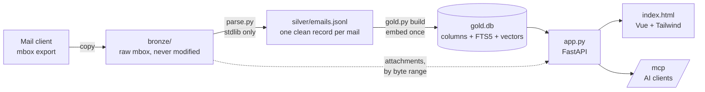
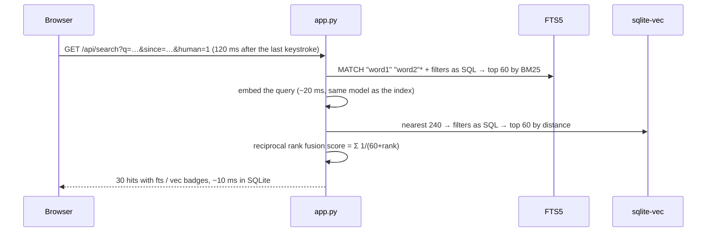

# email-archive

**Your mail, searchable forever, in one folder.**

[](https://github.com/Noerdsteil/email-archive/actions)
 

Export your mailboxes once, drop them in a folder, run `docker compose up`. You get instant keyword + semantic
search over every mail you ever sent or received, a reading pane with threads and attachments, an image export,
and an MCP endpoint so an AI assistant can search the archive too. Everything runs on your machine in one
container. Nothing leaves it.

Built in a day as a personal answer to a boring question: what happens to twenty years of mail when the provider,
the client or the plan changes? The answer is a folder that any machine with Docker can bring back to life.

<!-- screenshot: docs/screenshot.png (taken on the demo mailbox, `make demo`) -->

## What it does

- **Hybrid search** — full-text (SQLite FTS5) and semantic (embeddings in sqlite-vec) fused by reciprocal rank
  fusion. "Backup fehlgeschlagen" finds the mail that says "die Sicherung ist nicht durchgelaufen".
- **Instant** — results update 120 ms after the last keystroke, ↑↓ moves the selection, Esc resets.
- **Browse** — empty query shows the whole archive newest first with infinite scroll.
- **Filters** — sender, date range, people only (no newsletters, no robots), with attachments. All mirrored in the URL,
  so a bookmark is a saved search.
- **Reading pane** — full mail, thread navigation, attachments streamed on demand from the original mbox.
- **People vs. machines** — everyone you ever wrote to counts as a person; List-Id, noreply and friends count as
  machines; the rest is marked unknown. Learned from your own sent mail, no model, no rules to maintain.
- **Image export** — one button writes every photo from the filtered mails to a folder, dated like the mail.
- **MCP server** — two tools, `search_emails` and `get_email`, for Claude Code or a local LLM front-end.
- **Portable** — the folder is the whole state. `./export.sh` zips it, `docker compose up` on the other side.

## Getting started

You need Docker (Docker Desktop, OrbStack or Docker Engine). Nothing else.

```sh
git clone https://github.com/Noerdsteil/email-archive && cd email-archive
cp .env.example .env            # put your own addresses or @domains in here
docker compose up -d            # first run builds the image and downloads the embedding model (~310 MB)
```

Open <http://localhost:8000>. The archive is empty until you import mail:

1. **Export mailboxes as mbox** into `bronze/`. Apple Mail: select a mailbox, *Mailbox → Export Mailbox…*.
   Any `*.mbox` folder or file and any `*.eml` files under `bronze/` are picked up, folder by folder.
2. **Import**
   ```sh
   ./import.sh                  # parse -> index -> restart, prints the metrics. ~4 mails/s on a laptop CPU, Ctrl+C safe
   ```
3. **Add mail later**: drop more mbox files into `bronze/`, run `./import.sh` again. Only new mail is embedded;
   duplicates across folders are dropped by Message-ID.

`make` lists the everyday commands (`up`, `import`, `demo`, `test`, `export`, `logs`, `down`).

### Try it without your mail

```sh
make demo                       # synthetic mailbox of 20 invented mails under demo/, served on http://localhost:8001
```

Threads, a newsletter, an invoice, a shop conversation, a photo attachment. Nothing in `demo/` touches your archive.
This is also what the tests and the screenshots use.

## How it works

Three layers, each rebuildable from the one below. Nothing is ever the only copy.



**`parse.py`** (standard library only) decodes MIME, prefers plain text over HTML, strips quoted replies and
signatures, dedupes on Message-ID, threads via References, derives sent/received from your addresses, remembers
where each mail lives in bronze, and classifies every sender as human, machine or unknown. Prints metrics at the
end so you can see what your archive looks like before you index it.

**`gold.py`** embeds every mail with `jinaai/jina-embeddings-v2-base-de` (German + English, 8192 tokens, one
vector per mail) through fastembed/ONNX on CPU, and stores columns, FTS5 and sqlite-vec in one file. The model is
baked into the Docker image, so the index can never drift from the model that built it. Side tables `sources` and
`classes` are refreshed on every build without re-embedding, so a classifier change costs seconds, not an hour.

**`app.py`** is a small FastAPI service: `GET /api/search`, `GET /api/email`, `GET /api/attachment`,
`POST /api/export-images`, and the MCP server at `/mcp`. **`static/index.html`** is one file: Vue 3 and Tailwind 4
from vendored builds, no build step, Everforest colours.

### How a query travels



With an empty query the same endpoint pages through the archive newest first with a keyset cursor
(`before=date|id`), so page 400 costs the same as page 1.

### What a real archive looks like

Parser metrics from the author's archive, 27k mails from four mbox exports spanning 2013 to 2024:

| | |
|---|---|
| mails after dedupe | 27 730 (3 028 duplicates across folders dropped, 0 parse failures) |
| sender class | human 26 % · machine 50 % · unknown 25 % (436 contacts learned from sent mail) |
| html-only bodies | 25 % |
| with attachments | 14 % |
| body length | median 140 words, p95 1 071, longest 35 224 |
| threads | 24 613, largest 29 mails |
| index build | ~4 mails/s on an M-series laptop, resumable |
| query | ~10 ms in SQLite plus embedding the query |

## Use it from an AI client

The server speaks MCP (Streamable HTTP) at `http://localhost:8000/mcp`. `search_emails` returns short hits,
`get_email` returns one mail with quotes stripped plus its thread. Results are kept small on purpose so a model can
search a few times before reading a mail.

```sh
claude mcp add --transport http email-archive http://localhost:8000/mcp   # Claude Code
npx @modelcontextprotocol/inspector http://localhost:8000/mcp            # click through the tools by hand
```

Anything you connect reads your mail. A cloud model sees every mail it fetches; a local LLM front-end that speaks
MCP (Open WebUI, LM Studio, Ollama-based UIs) keeps it on your machine. The endpoint accepts localhost only.

## Export images

The **Images** button runs `POST /api/export-images` with the current filters and writes every image over 50 KB
to `exports/images/`, named `date_sender_hash_name`, file date set to the mail date, duplicates saved once.
`python export_images.py` does the same for all mail from people, without the UI.

## Configuration

Everything tunable sits in `settings.py`, each value overridable by an environment variable
(set them in `compose.yaml` or `.env`):

| Variable | Default | What |
|---|---|---|
| `OWN_ADDRESSES` | | your addresses or `@domains`, comma separated; decides sent vs. received |
| `DATA_DIR` | `.` | where `bronze/`, `silver/`, `gold.db` live (`demo` for the trial archive) |
| `EMBED_MODEL` / `EMBED_DIM` | jina-v2-base-de / 768 | any fastembed model; rebuild the image and `gold.py build --rebuild` |
| `EMBED_CHARS` | 20000 | body characters fed to the model |
| `PAGE_SIZE` | 30 | rows per browse page and default hit count |
| `FUSION_K` | 60 | candidates per retriever before rank fusion |
| `IMAGE_MIN_KB` | 50 | image export: smaller files are logos and pixels |

## Move it to another machine

```sh
./export.sh        # -> email-archive-YYYYMMDD.zip with code, .env, gold.db, silver/, bronze/
```

Unzip on the target, `docker compose up -d`. `bronze/` is included because attachments are read from it on demand;
`.git`, `.venv` and `models/` are not (the model is inside the image).

## Local development without Docker

Needs a Python whose sqlite allows extension loading (Homebrew `python3.13` on macOS; the system Python does not).

```sh
python3.13 -m venv .venv && .venv/bin/pip install -r requirements.txt
OWN_ADDRESSES="@example.com" .venv/bin/python parse.py
.venv/bin/python gold.py build                       # downloads the model into ./models on first run
.venv/bin/uvicorn app:app --reload --port 8000
make test                                            # test_parse.py (parser) + test_search.py (demo mailbox end to end)
.venv/bin/python test_mcp.py                         # MCP self-check against a running server
```

`onnxruntime` is pinned to 1.22.1: 1.29 returns NaN and 1.23+ fails to load this model on arm64.
CI runs both tests on every push, with the model cached between runs.

## Design notes

- **Silver is the contract, gold is disposable.** Every decision about embeddings can be revisited by deleting one file.
- **The model lives with the index.** No embedding service to keep in sync, no second container.
- **Bronze is read at runtime only for attachments**, by byte range, nothing copied. The price: bronze has to stay in place.
- **SQLite over Postgres.** One file, no volume, smaller image. FTS5 and sqlite-vec cover everything a personal archive needs.
- **Standard library first.** The parser has no dependencies. The UI has no build step.

## Limitations

- **Tested with Apple Mail exports on macOS.** Any mbox should work (Thunderbird, Gmail Takeout after unzipping),
  but folder naming (`Name.mbox/mbox`, `_Sent` suffix as fallback) follows Apple Mail and nothing else has been tried.
- **German and English.** The embedding model is bilingual; other languages fall back to keyword search quality.
- **One user, no login.** The server binds to localhost and trusts whoever reaches it. Do not expose the port.
- **CPU embedding is slow once.** About four mails per second; a 30k archive takes a couple of hours, resumable.
- **Long mails are truncated** at roughly 8k tokens for the vector; the full text is still searchable by keyword.
- **Mails render as text.** HTML is flattened, inline images are not shown, attachments are not indexed.
- **Bronze must stay.** Attachments are read from the original mbox; move it and the links break until the next import.
- **Not from `~/Downloads` on macOS.** Docker cannot read that folder unless you grant it access; the page then fails with
  `Operation not permitted`. Unzip the export somewhere else, `~/Documents` works.
- **The list is a plain DOM list.** Comfortable to about 10k rows on screen; scroll further and it gets heavy.
- **Sender classes are heuristics.** A quarter of senders end up unknown. Good enough for a filter, not for a rule.

## Not built yet

Chat against a local LLM through the MCP tools, an LLM pass over the unknown senders, attachment text
extraction, virtual scrolling, export guides for other mail clients. See [CONTRIBUTING.md](CONTRIBUTING.md).

## License

MIT. Made by [Jonas Schweizer](https://www.schweizer-jonas.de).
